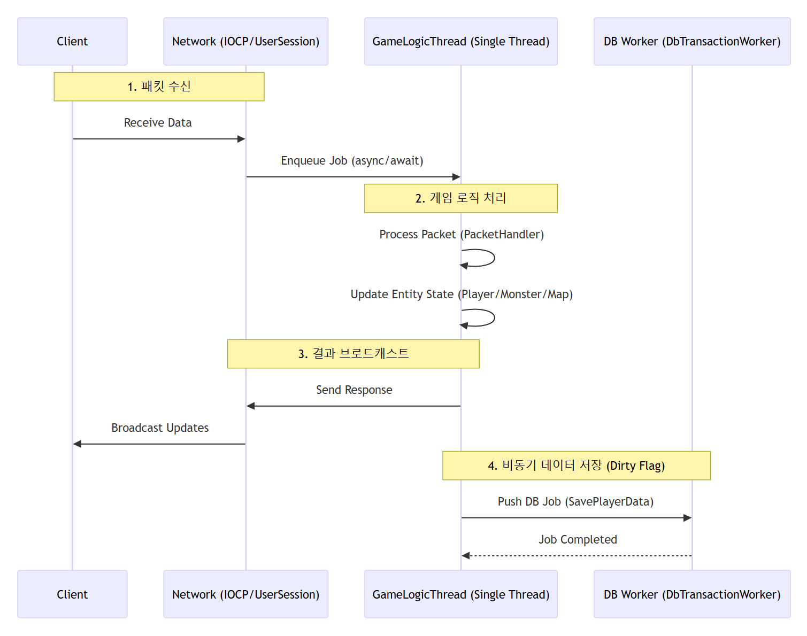
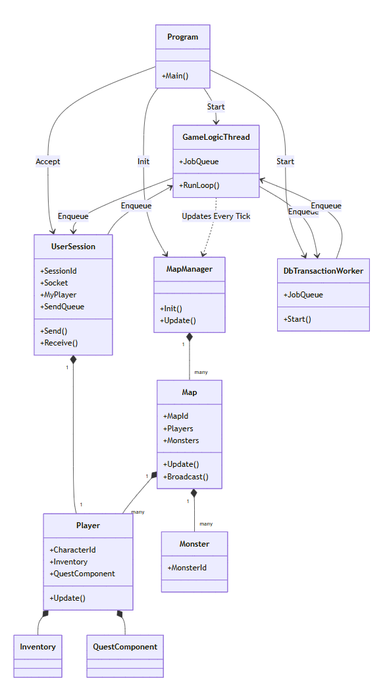
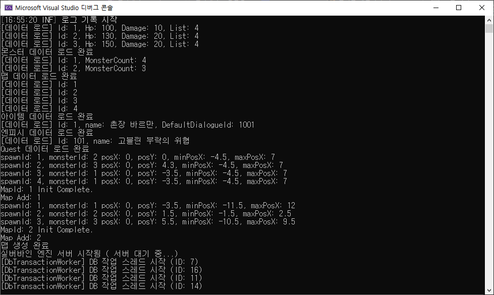

# 🚀 C# Game Server
> **NDC2018 [실버바인 서버 엔진 2] 설계 리뷰를 바탕으로 재구성한 C# IOCP & Stackless Fiber 서버**

---

## 1. 프로젝트 소개
- 프로젝트 명: C# GameServer (Silvervine Engine 2 Reference)
- 설명: 마비노기 모바일에서 사용된 실버바인 서버 엔진의 구조를 학습하고 IOCP 기반의 비동기 소켓 통신과 싱글 스레드 게임 로직 처리를 C#으로 구현한 프로젝트

## 2. 핵심 기술 스택
- 언어: C#
- 네트워크: IOCP
- 데이터 형식: JSON[리소스 로드, 패킷 직렬화(일부는 ProtoBuf 테스트 사용)]
- 데이터베이스: MySQL, Dapper(ORM)
- 로깅: Serilog(Seq 연동)

## 3. 아키텍처

### 🏗️데이터 흐름도
> 클라이언트의 요청이 IOCP를 통해 수신되어 싱글 스레드 게임 로직에서 처리되고, 비동기 DB 작업으로 이어지는 전체 파이프라인

### 🧱서버 컴포넌트 구조
> 서버의 주요 도메인 간의 관계와 구조

### ⚡실버바인 서버엔진2 아키텍처 따라하기
- **Stackless Fiber 기반 로직 처리**
	- 실버바인의 Stackful Fiber 구조를 분석하여 C#의 `async/await`와 Task를 활용하여 `Stackless` 방식으로 구현
	- 비동기 IO 대기 구간이 포함된 로직을 동기식 순차 코드처럼 작성할 수 있게 하여 생산성을 높이는 구조로 설계
- **Single-Thread Game Loop**
	- 모든 게임 로직을 `싱글 스레드` 루프에서 순차적으로 처리하여 `데이터 일관성`을 보장
	- 멀티스레드 환경의 `경쟁상태`와 `데드락` 문제를 근본적으로 제거하여 로직 설계 난이도를 낮춤
- **Job Queue 시스템**
	- `네트워크 IO` 와 `DB` 작업을 `게임 로직 스레드`와 분리하여 병목 현상 없는 구조로 설계

### 📈 성능 지표
- **처리량:** 동시 접속자 500명, 초당 10만 패킷(이동 패킷 200/s) 무난하게 처리 가능
- **안정성:** 대규모 브로드캐스팅 상황에서도 **평균 루프 타임 8ms** 미만 유지(루프는 몬스터, 플레이어 브로드 캐스트 로직도 처리 중인 상태)
	
### 🌐 네트워크
- **IOCP 기반 비동기 네트워크**
	- 적은 수의 스레드로 여러 접속자를 효율적으로 처리
	- 세션마다 버퍼풀과 SocketAsyncEventArgs를 활용하여 GC 부담을 최소화
	- ArraySegment를 활용하는 RecvBuffer 클래스를 통해 메모리 절약

### 💾 데이터베이스
- **비동기 DB 워커**
	- 별도의 DB 전용 스레드로 분리하여 게임 로직의 중단(Blocking) 없이 안전하게 데이터를 저장하고 불러올 수 있도록 설계

### 🎮 MMORPG 게임 콘텐츠 시스템 구성
| 시스템 명칭 | 주요 역할 및 상세 기능 |
| :--- | :--- |
| **인증 시스템** | 클라이언트 접속 제어, DB 연동을 통한 사용자 인증 및 캐릭터 정보 로딩 |
| **엔티티 관리** | **플레이어** 및 **몬스터** 객체의 생명주기 및 상태 관리 |
| **월드 시스템** | 게임 내 **맵** 데이터 관리 및 구역별 엔티티 동기화 |
| **상호작용 시스템** | **NPC** 대화, **퀘스트** 수락/완료 로직 및 보상 처리 |
| **아이템 시스템** | **인벤토리** 관리, 아이템 획득 및 사용 로직 처리 |
| **리소스 로드 시스템** | **JSON 기반 리소스 관리 클래스**를 통해 코드 수정없이 콘텐츠 확장 가능 |

## 4. 설계 상세 및 문서
- **[C# GameServer 문서](./CsharpGameServer-Doc/README.md)**

## 5. 구동 이미지

## 🔗 관련 링크
- [실버바인 서버 엔진 2 설계 리뷰 (NDC2018)](http://ndcreplay.nexon.com/NDC2018/sessions/NDC2018_0075.html)
- [C# GameServer 클라이언트](https://github.com/devhwan0421/MiniRPG)